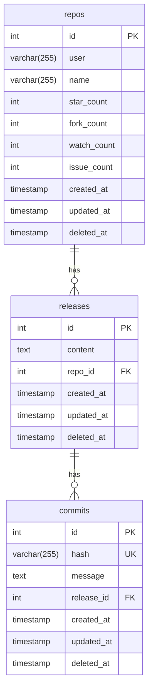
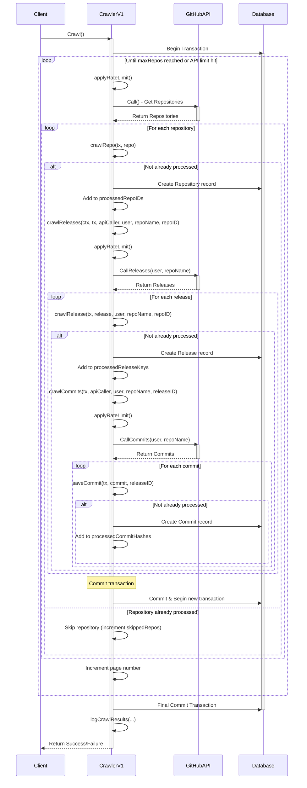
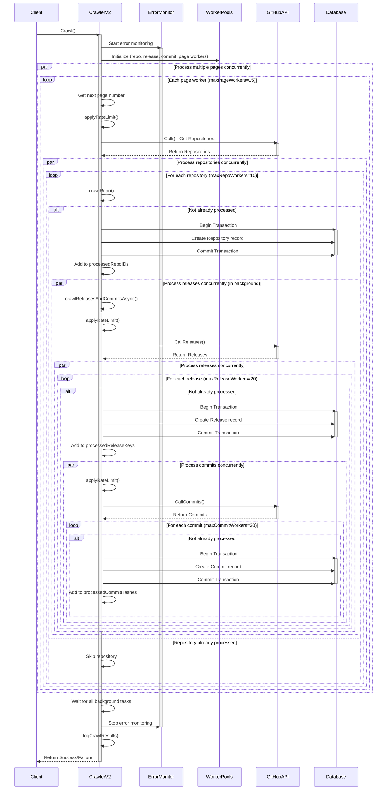

# Github repository crawler

Project này crawl thông tin (name, start, ...) của các repository được public trên github.

## Start project

*   `go mod vendor`
*   `go mod tidy`
*   `go run cmd/run/main -version=v1`

## Pre-condition

Cần crawl đủ 5000 repository của github có số sao cao nhất. Các thông tin cần crawl bao gồm:
*   Tên repository
*   Số lượng sao

Rate limiting của github:
*   10 requests / 1 minute (nếu không có token)
*   30 requests / 1 minute (nếu có token)
*   Chỉ lấy được tối đa 1000 kết quả trên mỗi truy vấn

Rate limiting sẽ lấy theo token nếu token có được thêm vào. Nếu không có thì sẽ lấy theo IP của client. Nên cân nhắc (trade off) có sử dụng proxy để giải quyết bài toán rate limiting hay không (khi sử dụng nó thì có tốt hơn việc sử dụng token hay không).

Chúng ta có thể thêm nhiều token vào để sử dụng khi một token hết rate limiting thì chuyển sang sử dụng token khác.

### Github API

Github APIs
*   `https://api.github.com/search/repositories?q=stars:>1&sort=stars&order=desc&per_page=12` được sử dụng để lấy các thông tin cần thiết từ repo
*   `https://api.github.com/rate_limit` check rate limit

### Thu thập thông tin repo
`https://api.github.com/search/repositories?q=stars:>1&sort=stars&order=desc`

**Cách thức hoạt động:**
- Crawler gọi GitHub Search API để lấy danh sách repository
- API trả về danh sách các repositories được sắp xếp theo số lượng sao (stars) từ cao đến thấp
- Mỗi trang chứa tối đa 100 repositories (tham số `per_page=100`)
- Crawler thực hiện phân trang (pagination) bằng cách tăng tham số `page` để lấy tổng cộng 5000 repositories

**Mẫu phản hồi API:**
```json
{
  "total_count": 1234,
  "incomplete_results": false,
  "items": [
    {
      "id": 123456,
      "name": "repo-name",
      "full_name": "owner/repo-name",
      "owner": {
        "login": "owner",
        "id": 789
      },
      "html_url": "https://github.com/owner/repo-name",
      "description": "Mô tả repository",
      "stargazers_count": 100,
      "forks_count": 20,
      "updated_at": "2025-04-17T10:00:00Z"
    },
    ...
  ]
}
```

**Thông tin thu thập:**
- ID repository
- Tên repository
- Tên người dùng/tổ chức sở hữu (owner)
- Số lượng sao (stars)
- Số lượng fork
- Số lượng người theo dõi (watchers)
- Số lượng issues đang mở

### Thu thập thông tin releases

`https://api.github.com/repos/{user}/{repo}/releases`

**Cách thức hoạt động:**
- Sau khi lưu thông tin repository, crawler sẽ gọi đến GitHub Releases API cho mỗi repository
- URL được xây dựng dựa trên template, thay thế các placeholder `{user}` và `{repo}`
- Lấy toàn bộ thông tin release mà không giới hạn số lượng

**Mẫu phản hồi API:**
```json
[
  {
    "id": 123456,
    "tag_name": "v7.0.0",
    "name": "Rails 7.0.0",
    "created_at": "2025-04-01T10:00:00Z",
    "published_at": "2025-04-01T12:00:00Z",
    "body": "Ghi chú phát hành cho Rails 7.0.0...",
    "html_url": "https://github.com/rails/rails/releases/tag/v7.0.0",
    "assets": [
      {
        "name": "rails-7.0.0.zip",
        "size": 102400,
        "download_count": 100,
        "browser_download_url": "https://github.com/rails/rails/releases/download/v7.0.0/rails-7.0.0.zip"
      }
    ]
  },
  ...
]
```

**Thông tin thu thập:**
- Tag name (ví dụ: v1.0.0)
- Tên release
- Thời gian tạo và xuất bản
- Nội dung release (release notes)

### Thu thập thông tin commits

`https://api.github.com/repos/{user}/{repo}/commits`

**Cách thức hoạt động:**
- Sau khi lưu thông tin release, crawler sẽ gọi đến GitHub Commits API cho mỗi repository
- URL được xây dựng dựa trên template, với các placeholder `{user}` và `{repo}`
- Lấy toàn bộ commit mà không giới hạn số lượng

**Mẫu phản hồi API:**
```json
[
  {
    "sha": "abc123...",
    "commit": {
      "author": {
        "name": "Tên tác giả",
        "email": "author@example.com",
        "date": "2025-04-01T12:00:00Z"
      },
      "message": "Thêm tính năng mới cho Rails",
      "tree": {
        "sha": "def456...",
        "url": "https://api.github.com/repos/rails/rails/git/trees/def456..."
      }
    },
    "html_url": "https://github.com/rails/rails/commit/abc123...",
    "author": {
      "login": "author-login",
      "id": 789
    }
  },
  ...
]
```

**Thông tin thu thập:**
- SHA của commit
- Thông điệp commit
- Thông tin tác giả và thời gian commit

## Quy trình xử lý dữ liệu

1. Lấy và lưu repository từ GitHub
2. Lấy và lưu tất cả releases của repository đó, mỗi release liên kết với repository qua `repo_id`
3. Lấy và lưu tất cả commits của repository, mỗi commit được liên kết với một release qua `release_id`

Crawler sử dụng giao dịch (transaction) để đảm bảo tính nhất quán của dữ liệu, đồng thời kiểm tra trùng lặp để tránh lưu cùng một dữ liệu nhiều lần.

### Giới hạn và tối ưu hóa

- **Rate Limiting**: GitHub giới hạn số lượng request (5000/giờ với token, 60/giờ không có token)
- **Pagination**: GitHub Search API chỉ trả về tối đa 1000 kết quả
- **Truncation**: Tự động cắt nội dung dài để phù hợp với giới hạn của database
- **Request Throttling**: Giới hạn số lượng request mỗi giây để tránh bị GitHub chặn

## Database



## Crawler versioning

### Version 1

Crawl thông qua API search repository của github
*   Tuần tự gửi từng request
*   Bị chặn bởi limit 1000 record cho mỗi query
*   Có áp dụng Rate limiting để chờ request nếu bị chặn
*   Lưu được thông tin repo, commit, release vào database mysql



### Version 2

Crawler version 2
*   Crawl bất đồng bộ sử dụng nhiều worker
*   Semaphore để kiểm soát và giới hạn API



### Version 3

Crawler version 2
*   Kế thừa bất đồng bộ từ V2
*   Time-based crawling strategy để pass qua limit 1000 repo trong mỗi query
*   Chia thành 2 phase cho crawl (crawl số lượng repo trước và crawl commit và release của repo sau)

## Compare

## Run command and access via `http://localhost:6060/pkg/prepuld/?m=all`

```sh
godoc -http=:6060
```
