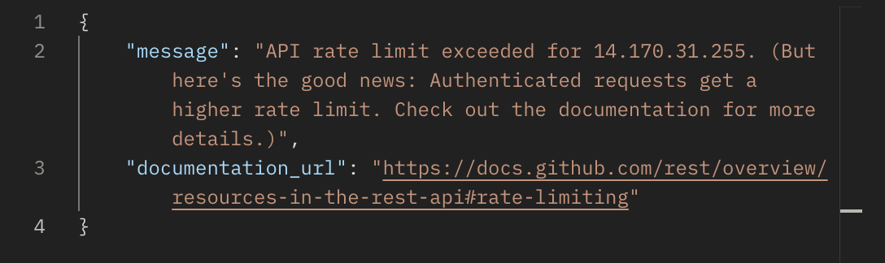
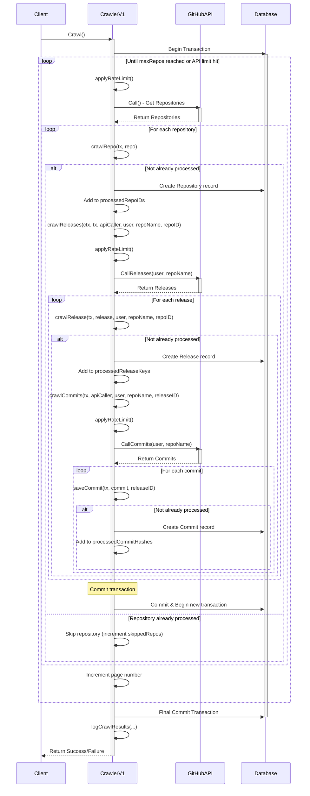

# Github repository crawler

Project này crawl thông tin (name, start, ...) của các repository được public trên github.

## Start project

*   `go mod vendor`
*   `go mod tidy`
*   `go run cmd/run/main -version=v1`

## Pre-condition

Cần crawl đủ 5000 repository của github có số sao cao nhất. Các thông tin cần crawl bao gồm:
*   Tên repository
*   Số lượng sao

Rate limiting của github:
*   10 requests / 1 minute (nếu không có token)
*   30 requests / 1 minute (nếu có token)
*   Chỉ lấy được tối đa 1000 kết quả trên mỗi truy vấn



Rate limiting sẽ lấy theo token nếu token có được thêm vào. Nếu không có thì sẽ lấy theo IP của client. Nên cân nhắc (trade off) có sử dụng proxy để giải quyết bài toán rate limiting hay không (khi sử dụng nó thì có tốt hơn việc sử dụng token hay không).

Chúng ta có thể thêm nhiều token vào để sử dụng khi một token hết rate limiting thì chuyển sang sử dụng token khác.

## Github API

Github APIs
*   `https://api.github.com/search/repositories?q=stars:>1&sort=stars&order=desc&per_page=12` được sử dụng để lấy các thông tin cần thiết từ repo
*   `https://api.github.com/rate_limit` check rate limit

## Version growing

### V1

Crawl thông qua API search repository của github. Crawler tuần tự từng request cho tới khi hết rate limit hoặc đã crawl đủ 5000 repo có số sao cao nhất.



### V2

### V3

## Compare

## Run command and access via `http://localhost:6060/pkg/prepuld/?m=all`

```sh
godoc -http=:6060
```
