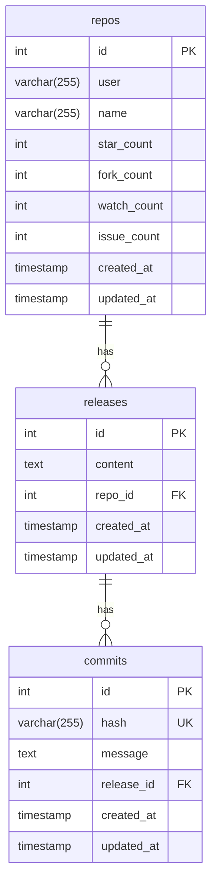
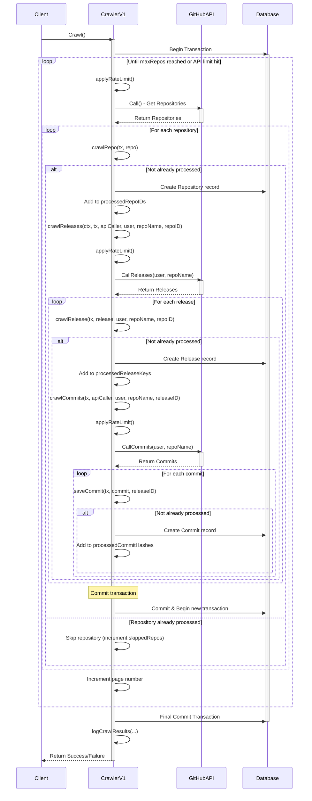
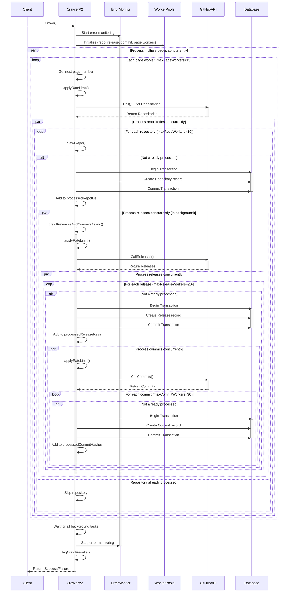

# Github repository crawler

Project này crawl thông tin của 5000 `repository` có nhiều sao nhất trên github. Có bao gồm thông tin về `release` và `commits` tương ứng

## Starting

**Setting manual:**

*   Cài đặt golang version `1.23.0` (có thể cài đặt thông qua brew (Macos))
*   Clone và cd vào thư mục chứa source code này, sau đó chạy các command:
    *   `go mod vendor`
    *   `go mod tidy`

**Run crawler:**

*   `go run cmd/run/main -version=v1`
      *   `-version=v1`
      *   `-version=v2`
      *   `-version=v3`

**Run app UI:**

*   `go run cmd/ui/main -port=8080`

## Pre-condition

Cần crawl đủ 5000 repository của github có số sao cao nhất. Các thông tin cần crawl bao gồm:
*   Repository
*   Release
*   Commit

Rate limiting của github:
*   10 requests / 1 minute (nếu không có token)
*   30 requests / 1 minute (nếu có token)
*   Chỉ lấy được tối đa 1000 kết quả trên mỗi truy vấn

Rate limiting sẽ lấy theo token nếu token có được thêm vào. Nếu không có thì sẽ lấy theo IP của client. Nên cân nhắc (trade off) có sử dụng proxy để giải quyết bài toán rate limiting hay không (khi sử dụng nó thì có tốt hơn việc sử dụng token hay không).

Chúng ta có thể thêm nhiều token vào để sử dụng khi một token hết rate limiting thì chuyển sang sử dụng token khác.

### API Check ratelimit

`https://api.github.com/rate_limit`

### API Thu thập thông tin repository

`https://api.github.com/search/repositories?q=stars:>1&sort=stars&order=desc`

**Mẫu phản hồi API:**

```json
{
  "total_count": 1234,
  "incomplete_results": false,
  "items": [
    {
      "id": 123456,
      "name": "repo-name",
      "full_name": "owner/repo-name",
      "owner": {
        "login": "owner",
        "id": 789
      },
      "html_url": "https://github.com/owner/repo-name",
      "description": "Mô tả repository",
      "stargazers_count": 100,
      "forks_count": 20,
      "updated_at": "2025-04-17T10:00:00Z"
    },
    ...
  ]
}
```

### API Thu thập thông tin releases

`https://api.github.com/repos/{user}/{repo}/releases`

**Mẫu phản hồi API:**

```json
[
  {
    "id": 123456,
    "tag_name": "v7.0.0",
    "name": "Rails 7.0.0",
    "created_at": "2025-04-01T10:00:00Z",
    "published_at": "2025-04-01T12:00:00Z",
    "body": "Ghi chú phát hành cho Rails 7.0.0...",
    "html_url": "https://github.com/rails/rails/releases/tag/v7.0.0",
    "assets": [
      {
        "name": "rails-7.0.0.zip",
        "size": 102400,
        "download_count": 100,
        "browser_download_url": "https://github.com/rails/rails/releases/download/v7.0.0/rails-7.0.0.zip"
      }
    ]
  },
  ...
]
```

### API Thu thập thông tin commits

`https://api.github.com/repos/{user}/{repo}/commits`

**Mẫu phản hồi API:**

```json
[
  {
    "sha": "abc123...",
    "commit": {
      "author": {
        "name": "Tên tác giả",
        "email": "author@example.com",
        "date": "2025-04-01T12:00:00Z"
      },
      "message": "Thêm tính năng mới cho Rails",
      "tree": {
        "sha": "def456...",
        "url": "https://api.github.com/repos/rails/rails/git/trees/def456..."
      }
    },
    "html_url": "https://github.com/rails/rails/commit/abc123...",
    "author": {
      "login": "author-login",
      "id": 789
    }
  },
  ...
]
```

## Database

Sử dụng database `mysql` Gồm có 3 bảng tương ứng như sau:



## Crawler versioning

### Version 1

Crawl thông qua API search repository của github
*   Tuần tự gửi từng request để lấy thông tin `repos`. Từ thông tin `repos` lấy thông tin `release` và từ thông tin `release` lấy thông tin `commits` tương ứng
*   Bị chặn bởi limit 1000 record cho mỗi query
*   Có áp dụng Rate limiting để hold request trong thời gian cố định chứ không bị chết app
*   Lưu được thông tin `repos`, `commits`, `releases` vào database



### Version 2

Crawler version 2
*   Kế thừa từ version 1
*   Sử dụng `worker pools pattern` để crawl bất đồng bộ các thông tin `repos`, `commits` và `releases`
*   Nâng cấp rate limiting bằng `Semaphore pattern`. Kiểm soát tốt hơn số lượng worker truy cập vào tài nguyên để write hoặc read
*   `Error monitor` để giám sát lỗi từ nhiều worker và xử lý (retry 3 lần với backoff timing)



### Version 3

Crawler version 3
*   Kế thừa bất đồng bộ từ 2 version trước (1 và 2)
*   `Time-based crawling strategy` để pass qua limit 1000 repo trong mỗi query. Đồng thời thêm `time worker window` để chạy bất đồng bộ trên nhiều khoảng thời gian.
*   Chia thành `2 phases`
    *   Phase 1 crawl nhiều repository từ time base. Sau đó lọc và chỉ lấy 5000 repository có số sao cao nhất
    *   Phase 2 thực hiện crawl thông tin `releases` và `commits` tương ứng của 5000 `repos` đã được chọn ở trên
*   Thêm `logging` chi tiết hơn.

```mermaid
sequenceDiagram
    participant Client
    participant CrawlerV3
    participant TimeWindowWorkers
    participant ErrorMonitor
    participant WorkerPools
    participant GitHubAPI
    participant Database

    Client->>CrawlerV3: Crawl()
    activate CrawlerV3

    CrawlerV3->>ErrorMonitor: Start error monitoring
    activate ErrorMonitor

    CrawlerV3->>WorkerPools: Initialize (repo, release, commit, page workers)

    %% Phase 1: Repository Collection
    CrawlerV3->>CrawlerV3: collectRepositoriesPhase()

    par Phase 1: Multiple time windows processed concurrently
        loop For each time window worker (maxConcurrentWindows=2)
            CrawlerV3->>CrawlerV3: getNextTimeWindow()

            par Multiple pages per time window
                loop Each page (maxPagesPerWindow=10)
                    CrawlerV3->>TimeWindowWorkers: crawlTimeWindowPage()
                    activate TimeWindowWorkers
                    TimeWindowWorkers->>TimeWindowWorkers: applyRateLimit()
                    TimeWindowWorkers->>GitHubAPI: Call() - Get Repositories by time range
                    activate GitHubAPI
                    GitHubAPI-->>TimeWindowWorkers: Return Repositories
                    deactivate GitHubAPI

                    TimeWindowWorkers->>TimeWindowWorkers: Store in allRepos collection

                    alt Collected >= 10000 repos
                        TimeWindowWorkers->>CrawlerV3: Signal collection phase complete
                    end
                    deactivate TimeWindowWorkers
                end
            end
        end
    end

    %% Phase 2: Processing Repositories
    CrawlerV3->>CrawlerV3: processRepositoriesPhase()
    CrawlerV3->>CrawlerV3: processTopRepositories()
    CrawlerV3->>CrawlerV3: Sort repositories by stars
    CrawlerV3->>CrawlerV3: Take top 5000 repositories

    par Phase 2: Process top repositories concurrently
        loop For each repository (maxRepoWorkers=10)
            CrawlerV3->>CrawlerV3: crawlRepo()

            alt Not already processed
                CrawlerV3->>Database: Begin Transaction
                activate Database
                CrawlerV3->>Database: Create Repository record
                CrawlerV3->>Database: Commit Transaction
                deactivate Database
                CrawlerV3->>CrawlerV3: Add to processedRepoIDs

                alt In top 2000 repos
                    par Process releases concurrently (in background)
                        CrawlerV3->>CrawlerV3: crawlReleasesAndCommitsAsync()
                        activate CrawlerV3
                        CrawlerV3->>CrawlerV3: applyRateLimit()
                        CrawlerV3->>GitHubAPI: CallReleases()
                        activate GitHubAPI
                        GitHubAPI-->>CrawlerV3: Return Releases
                        deactivate GitHubAPI

                        par Process releases concurrently
                            loop For each release (maxReleaseWorkers=20)
                                alt Not already processed
                                    CrawlerV3->>Database: Begin Transaction
                                    activate Database
                                    CrawlerV3->>Database: Create Release record
                                    CrawlerV3->>Database: Commit Transaction
                                    deactivate Database
                                    CrawlerV3->>CrawlerV3: Add to processedReleaseKeys

                                    par Process commits concurrently
                                        CrawlerV3->>CrawlerV3: applyRateLimit()
                                        CrawlerV3->>GitHubAPI: CallCommits()
                                        activate GitHubAPI
                                        GitHubAPI-->>CrawlerV3: Return Commits
                                        deactivate GitHubAPI

                                        loop For each commit (maxCommitWorkers=30)
                                            alt Not already processed
                                                CrawlerV3->>Database: Begin Transaction
                                                activate Database
                                                CrawlerV3->>Database: Create Commit record
                                                CrawlerV3->>Database: Commit Transaction
                                                deactivate Database
                                                CrawlerV3->>CrawlerV3: Add to processedCommitHashes
                                            end
                                        end
                                    end
                                end
                            end
                        end
                        deactivate CrawlerV3
                    end
                end
            else Repository already processed
                CrawlerV3->>CrawlerV3: Skip repository
            end
        end
    end

    CrawlerV3->>CrawlerV3: Wait for all background tasks
    CrawlerV3->>ErrorMonitor: Stop error monitoring
    deactivate ErrorMonitor
    CrawlerV3->>CrawlerV3: logCrawlResults()
    CrawlerV3-->>Client: Return Success/Failure
    deactivate CrawlerV3
```




## Documentation

Clone source code chạy theo hướng dẫn ở phần `Starting`. Chạy command dưới và truy cập vào `http://localhost:6060/pkg/prepuld/?m=all` để đọc doc kỹ thuật của các module.

```sh
godoc -http=:6060
```
